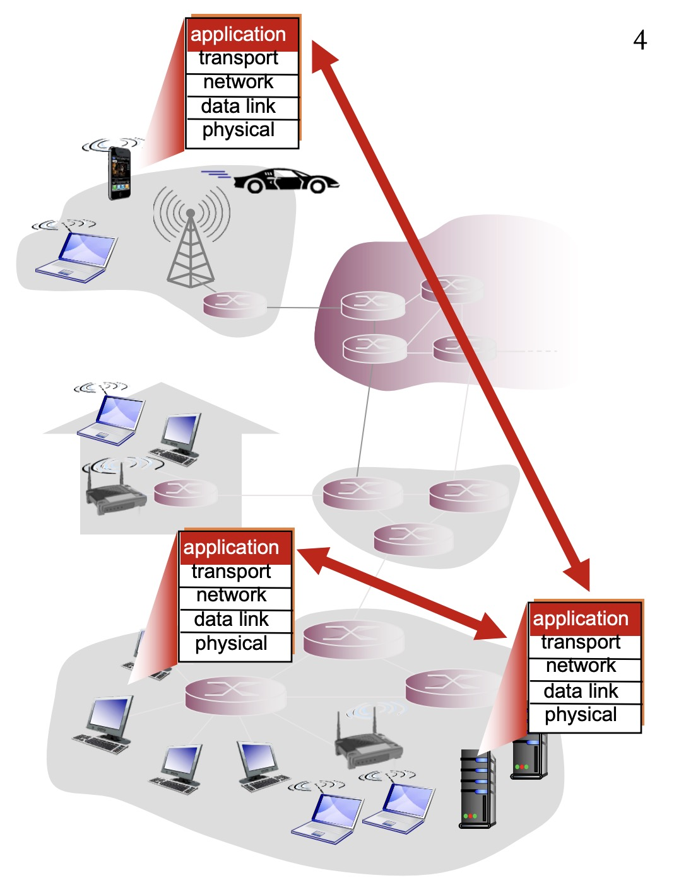
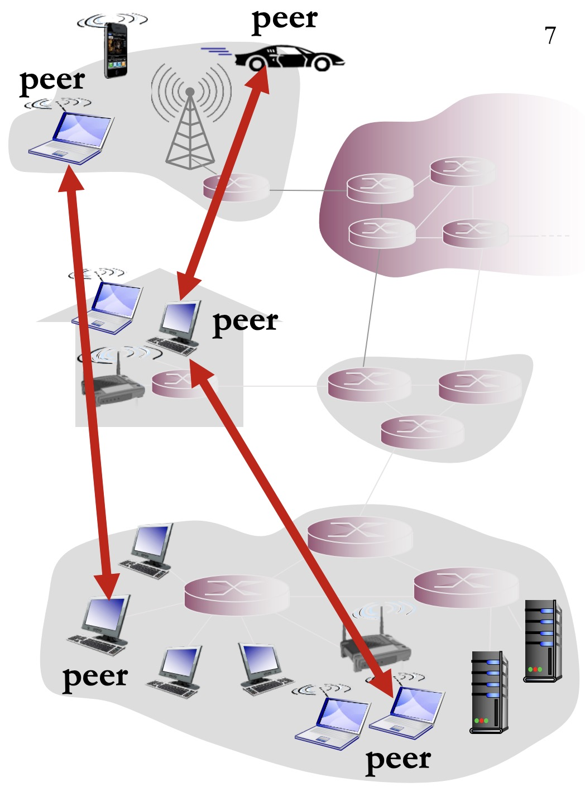
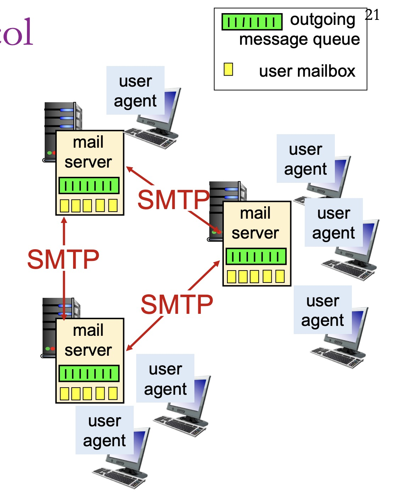
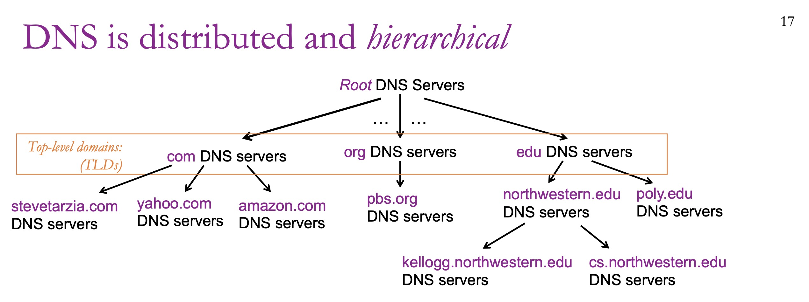
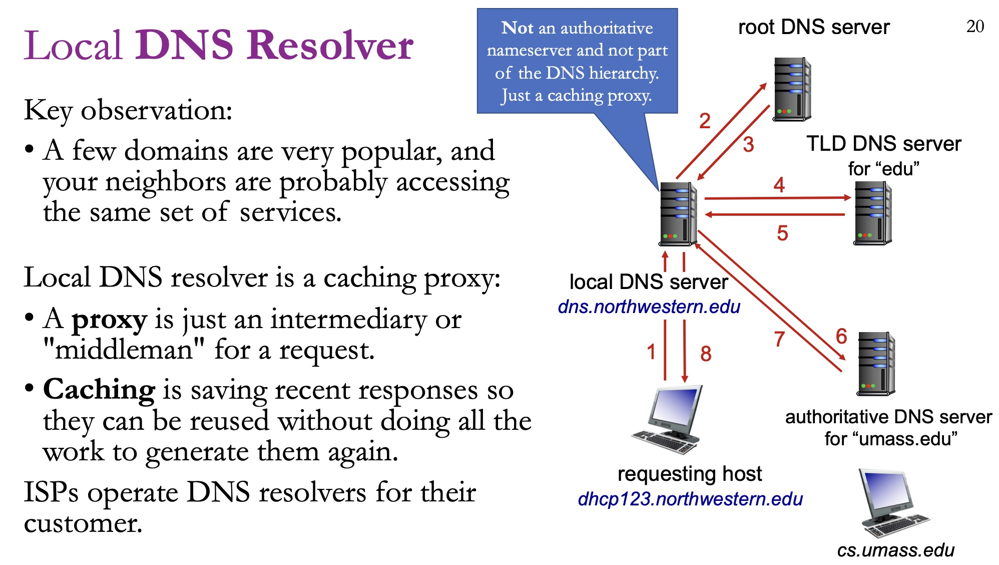
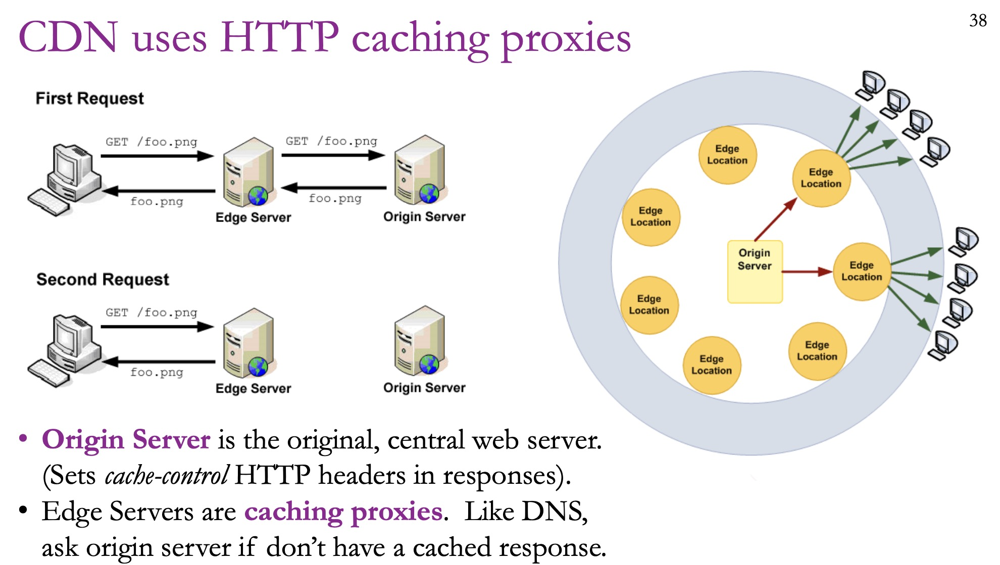

# Application Layer

---

## Application-layer protocols

**Purpose:** allow apps running on different computers to communicate.



---

## Architectures

**Client-server Architecture:** client will send request, and server will respond.

**Peer-to-peer Architecture:** all participants have equal responsibilities, and there is no central servers.



---

## Hyper Text Transport Protocol (HTTP)

HTTP was invented for browsers to fetch pages from webservers

**Request:**

- A human-readable header with: URL, method, (plus some optional headers)
- An optional body, storing raw data (bytes).

**Response:**

- A human-readable header with response code, (plus some optional headers)
- An optional body.

### Steps:

1. Client creates TCP socket (a bi-directional pipe of bytes), and server accepts the socket. 
2. Client writes HTTP request to socket; starts listening for response. 
3. Server notices new data on socket and starts reading request data. 
4. Server eventually notices that it has received a full HTTP request. 
5. Server does some work to generate an appropriate response. 
6. Server writes HTTP response to socket. 
7. Client reads and parses response data; stops reading after calculating that the response is complete.

### Cookie

Cookie is a small piece of data sent from a web server and stored on the user's computer by the web browser.

Cookies are generally used for **session management:** Keeping you logged in as you move between pages, or remembering what's in your shopping cart.

**Third party cookies** are cookies from a domain different that the currently viewed web page.

For example, if a site embeds a piece of code from `facebook.com`, Facebook can set its own cookie. Because the domain of the cookie (`facebook.com`) differs from the domain in your address bar (`news-site.com`), it is labeled **third-party**.

#### **Cross-Site Request Forgery (CSRF) attack**

A **Cross-Site Request Forgery (CSRF)** attack, also known as "one-click attack" or "session riding," exploits the fact that browsers automatically include credentials (like cookies) when making requests to a specific domain, regardless of which site the user is currently visiting. A web server cannot easily distinguish between a request initiated by a user's intentional action and a request initiated by a malicious script on a different site.

##### 1. The Setup (GET Attack)

A simple `` tag can trigger a GET request.

```html

```

If you are currently logged into `bank.com` in another tab, your browser will:

1. See the `src` attribute.
2. Automatically send a request to `bank.com`.
3. **Crucially**, attach your `bank.com` session cookies to that request.
4. The bank's server sees the cookies, thinks *you* requested the transfer, and processes it.

##### 2. The POST Variation

Many sensitive actions require a **POST** request. An attacker can still bypass this using a hidden HTML form that auto-submits via JavaScript:

```HTML
<form id="attackForm" action="https://bank.com/transfer" method="POST">
    <input type="hidden" name="amount" value="1000">
    <input type="hidden" name="to" value="attacker_account">
</form>
<script>
    document.getElementById('attackForm').submit();
</script>
```

##### Prevention Strategy

This is a modern and highly effective defense. It tells the browser whether to send cookies with "cross-site" requests.

- **`SameSite=Strict`:** The cookie is only sent if the request originates from the same site where the cookie was set.
- **`SameSite=Lax`:** (Now the default in most browsers). Cookies are not sent on cross-site subrequests (like images or frames) but are sent when a user navigates to the origin site (e.g., clicking a link).
- **`SameSite=None`:** Cookies are sent in all contexts (requires the `Secure` flag).

---

## Simple Mail Transport Protocol (SMTP)

SMTP is a **P2P protocol** used by mail servers to exchange users’ messages.

Mail servers act as clients when sending, and as servers when receiving. Each domain has its own mail server(s).



---

## Domain Name Service

DNS maps from human-friendly hostnames to IP addresses.

- Eg., “northwestern.edu” → 129.105.136.70

### DNS Scaling



**Root DNS Servers:** There are 13 root servers globally.

**Top-Level Domain (TLD) Servers:** These handle extensions like `.com`, `.org`, and `.edu`.

**Authoritative Servers:** These are the actual servers for a specific organization (like Northwestern) that hold the final records.

### Querying the DNS hierarchy



**DNS Record Time to Live:** the time record is on DNS resolver.

### Content Delivery Network

The physical distance between you and a server matters. If you're in Evanston and trying to reach a server in Beijing, you’ll see high latency (over 200ms).

To solve this, we use **Content Delivery Networks (CDNs)**. When you request a file, a smart DNS server looks at your IP address and directs you to the server physically closest to you.



