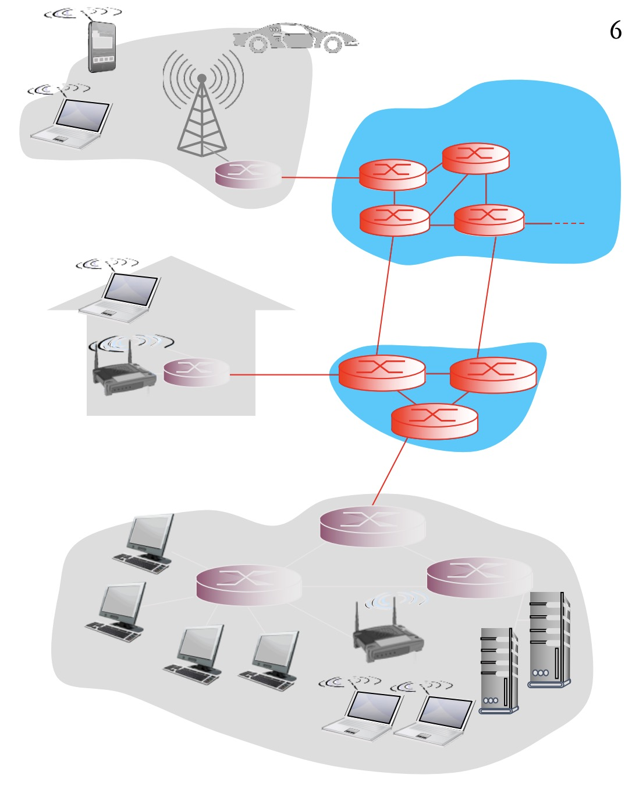
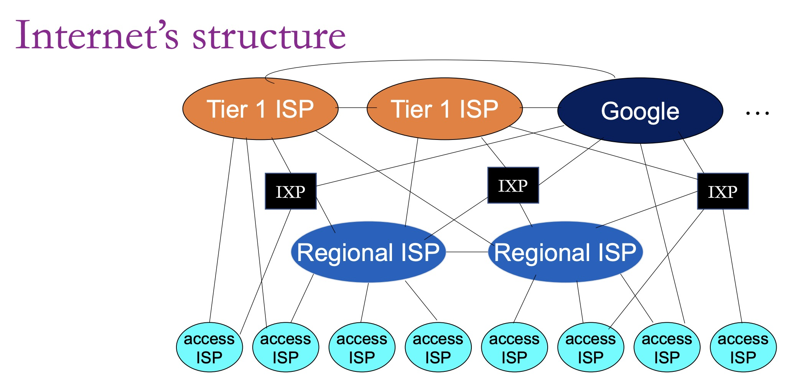
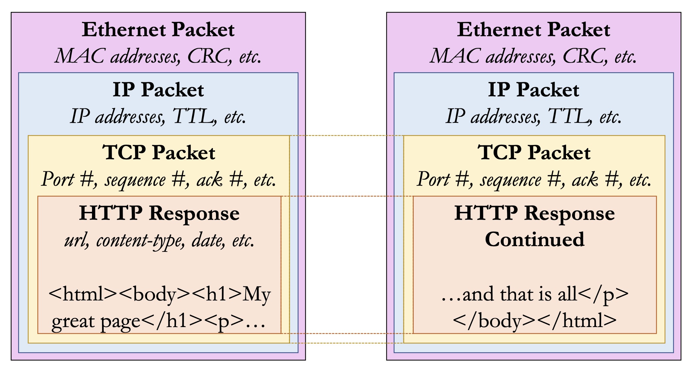

# Foundamentals

---

## Introduction

### What is the Internet?

The Internet is a **"network of networks"** consisting of billions of computing devices (hosts/end systems) interconnected globally.

---

## Internet Architecture

### Access Networks

Access networks connect end users to the Internet:

| **Type** | **Description** | **Characteristics** |
|----------|----------------|---------------------|
| **DSL (Digital Subscriber Line)** | Uses existing telephone lines | Data and voice transmitted at different frequencies |
| **Cable** | Uses coaxial cable distribution networks | Originally designed for TV; shared among neighborhoods |
| **Wireless** | Radio-based connectivity | WiFi (short range), Cellular (wide area), Satellite |

---

## Network Components

### Hosts

- Devices connected to the network (smartphones, servers, thermostats, etc.)
- Each host has a **unique IP address**
- Also called **end systems**

### Communication Links

Physical media that transmit data:
- **Copper wire**: Traditional, cost-effective
- **Fiber optic**: High-speed, long-distance
- **Radio**: Wireless transmission

### Switches

- Connects multiple devices within a single **Local Area Network (LAN)**
- Forwards data between devices on the same network

### Routers

A router is the gateway that connects your local network to the **Internet**.

**Two Key Responsibilities:**

1. **Distributed Routing Algorithms**
   - Determine which address ranges are most quickly reachable on each outbound link
   - Build and maintain routing tables

2. **Packet Forwarding**
   - Direct packets according to routing decisions
   - Forward packets to the appropriate next hop

---

## Switching Methods

### Circuit Switching vs. Packet Switching

| **Feature** | **Circuit Switching** | **Packet Switching** |
|------------|----------------------|---------------------|
| **Method** | Dedicated end-to-end path established for each call | Data sent in small chunks (packets) |
| **Efficiency** | Can be wasteful during silence; "all or nothing" | Highly efficient for "bursty" traffic |
| **Performance** | Performance is guaranteed | "Best effort" delivery; no guarantees |
| **Usage** | Traditional telephone networks (PSTN) | Modern Internet |
| **Resource Allocation** | Resources reserved for duration of connection | Resources shared dynamically |

---

## Network Performance

### Four Sources of Nodal Delay

Total nodal delay: $d_{nodal} = d_{proc} + d_{queue} + d_{trans} + d_{prop}$

1. **Processing Delay ($d_{proc}$)**
   - Checking for bit errors
   - Determining output link (figure out where to go)
2. **Queueing Delay ($d_{queue}$)**
   - Time waiting at output link queue
   - If the finite-sized queue is full, **packets are dropped**
3. **Transmission Delay ($d_{trans}$)**
   - Formula: $d_{trans} = \frac{\text{Packet Size (bits)}}{\text{Link Bandwidth (bps)}}$
   - Time to push all packet bits onto the link
4. **Propagation Delay ($d_{prop}$)**
   - Formula: $d_{prop} = \frac{\text{Link Length}}{\text{Speed of Light}}$
   - Time for signal to travel through the medium

---

## Internet Structure

The Internet is organized hierarchically as a "network of networks":

### Tier-1 ISPs

- Large commercial Internet Service Providers
- Examples: AT&T, Verizon, Level 3, NTT

### Content Provider Networks

- Servers used to distribute content closer to users
- Examples: Google, Amazon, Facebook, Microsoft

### Interconnection

**Internet Exchange Points (IXPs)**
- a specialized data center where different internet infrastructure companies connect their networks to exchange data directly

**Peering Links**

- Settlement-free interconnection between ISPs.

---

## Protocol Stack

*Here is an analogy of mailing between friends to explain different layers of the network:*

1. **Application Layer:** What you're going to write in your letter. ("Hello!", "Acknowledged", "Goodbye!")
2. **Security Layer:** How to encrypt your letter. 
3. **The Transport Layer:** What rules to establish between you and your friend regarding sending letters to ensure a reliable communication. (For example, send an acknowledgement letter after receiving a letter)
4. **The Network Layer:** For the post office, how to figure out the best way to deliver the mail to a certain address.
5. **The Link Layer:** How to deliver the letter to the post office. 
