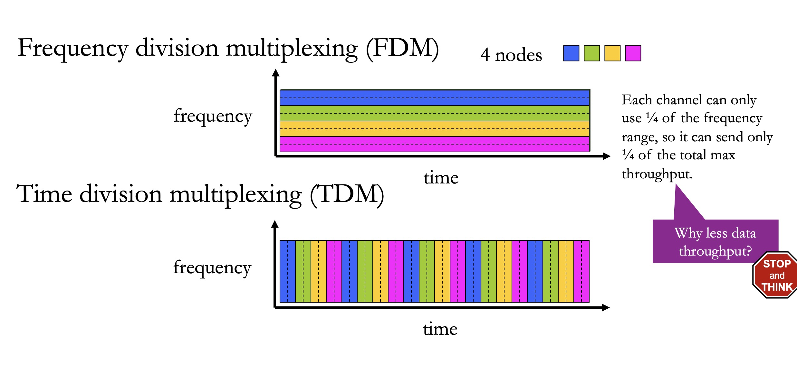
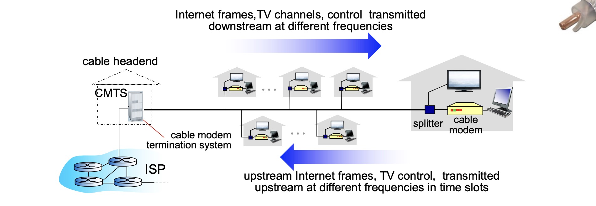
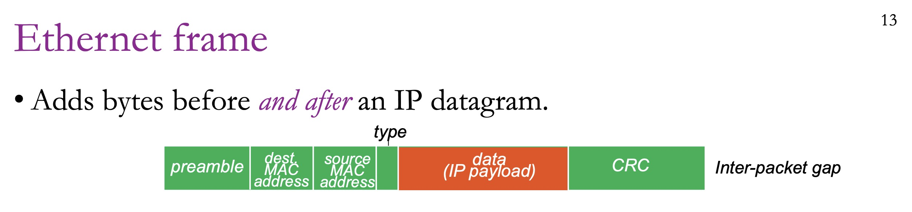
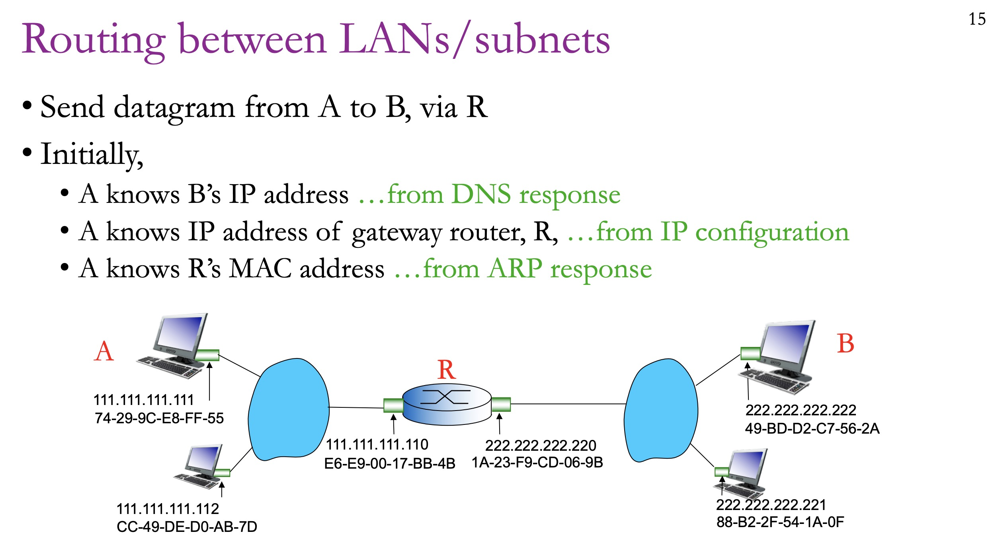
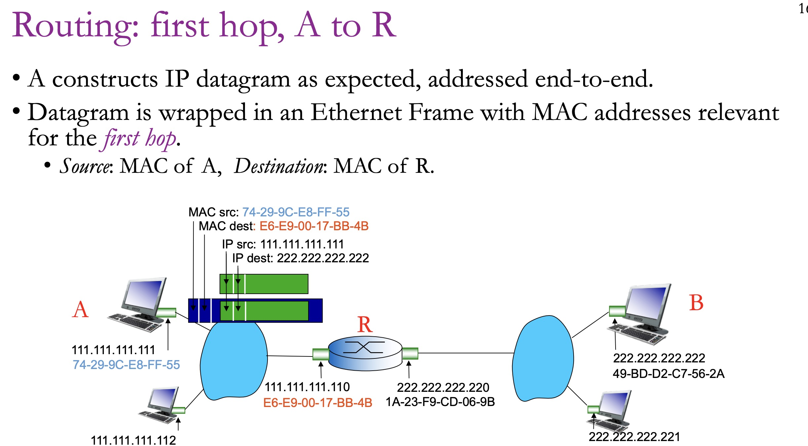
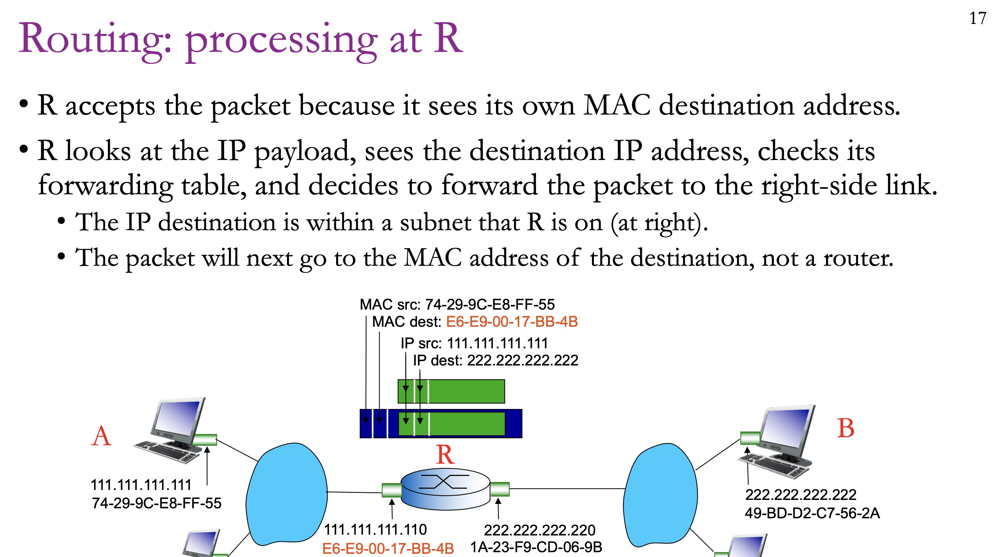
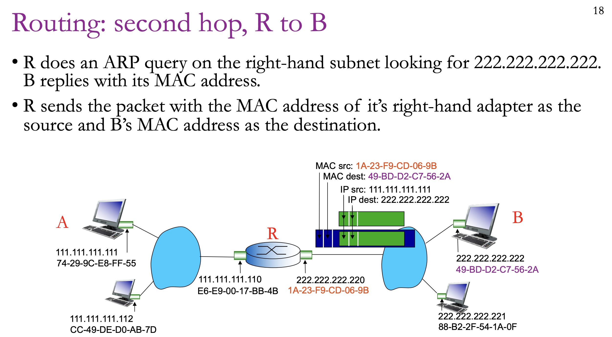

# Link Layer

The **link layer** handles communication between devices in the same local network. 

---

## Medium Access Control

Medium Access Control governs **how devices share and access a common communication channel**.

### Channel Partitioning Protocols

**Frequency Division Multiplexing:** each channel could only use a certain portion of bandwidth

**Time Division Multiplexing:** each channel use the whole bandwidth for an amount of time in a round robin way

Downside: inflexible. Max throughput is always fixed at B/N, where B is the total bandwidth and N is the number of channels.



### Random Access Protocols

**ALOHA:** each sender could send packet anytime. **When collision happens, wait a random delay before retransmission.** 

Specifically, if collision, retransmit the packet with probability *p* or wait with probability *p-1* for the time needed to send one packet.

Delay probability *p* should be tuned according to how busy the bandwidth is. For example, if the bandwidth is busy, use a lower *p*.

```
Host 1: send (collision) ………send (success)
Host 2: send (collision) ………………………………………… send (success)
```

**Slotted ALOHA:** requires time synchronization among senders.

- For example, senders are only allowed to send **one packet** at time 0, time 10, time 20.
- In this way, if one packet collides, it will only collide with 1 packet not 2. 

Pros: one sender can use full bandwidth.

Cons: poor throughput when busy.

### CSMA/CD

**Carrier Sensing:** listen to the channel before sending.

- If it’s busy, then wait.

**Collision Detection:** listen while transmitting.

- Stop transmission immediately if another transmission is heard.
- This minimizes the channel-time wasted due to collision.

Note: there is a delay between the actual state and monitoring (propagation delay), so collisions are unavoidable.

### Taking Turns Protocols

**Polling Protocol:** 

• One node is designated the Leader. 

• Leader polls the nodes in a round-robin manner, sending a message to each node telling it to send up to H packets. 

• Polling messages add some coordination overhead.

**Token-passing Protocols:**

• Nodes have a designated order 1…N. 

• One nodes transmits up to some maximum number of packets, then sends a special message (a token) giving the next node a turn. 

• Nodes only send packets while “holding” the token, so collisions are avoided. 

• If token-holding node crashes, the entire network is crashed. (like crashing the leader node in a polling protocol).

### DOCSIS: Cable Internet Link-Layer Protocol

Key idea: multiple houses are connected by one big wire.



---

## Ethernet

A link-layer protocol for wired local area networks. (Ethernet is not Wi-Fi!!!!!)

Ethernet uses CSMA/CD.

### MAC Address

A **MAC (Media Access Control) address** is a unique identifier assigned to a network interface card at the hardware level. It is used to identify devices on a local network segment.

*Question:* why we need to have MAC address when we have IP address?

*Answer:* IP address is changable and MAC address is permanent. 



### Address Resolution Protocol

Given an IP address, return the MAC address of the related device.

Steps:

- **Broadcast:** "Who has this IP?" → everyone hears it

- **Unicast reply:** "I do, here's my MAC" → only the matching device responds

- **Everyone else:** silence

### Routing between LANs/subnets









### Dynamic Host Configuration Protocol

DHCP is how hosts automatically get IP configuration.

Steps:

**1. Discover** Your device broadcasts to the entire network: *"Is there a DHCP server out there? I need an address!"*

**2. Offer** The DHCP server hears this and responds: *"I have an available IP — how about `192.168.1.10`? Here are the other settings too."*

**3. Request** Your device replies: *"Yes, I'd like that IP please!"*. It only responsed to the server.

**4. Acknowledge** The server confirms and records the assignment.


