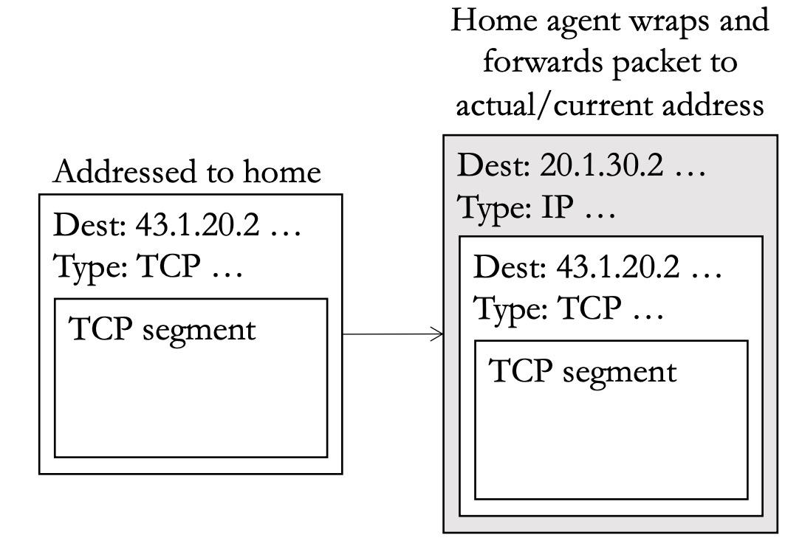
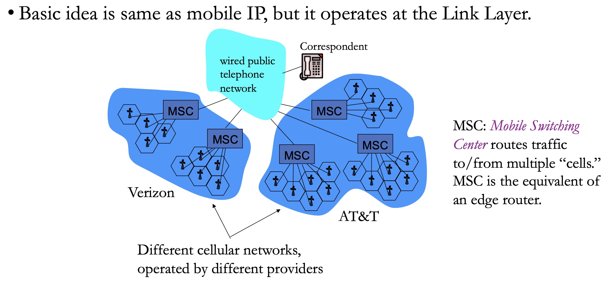
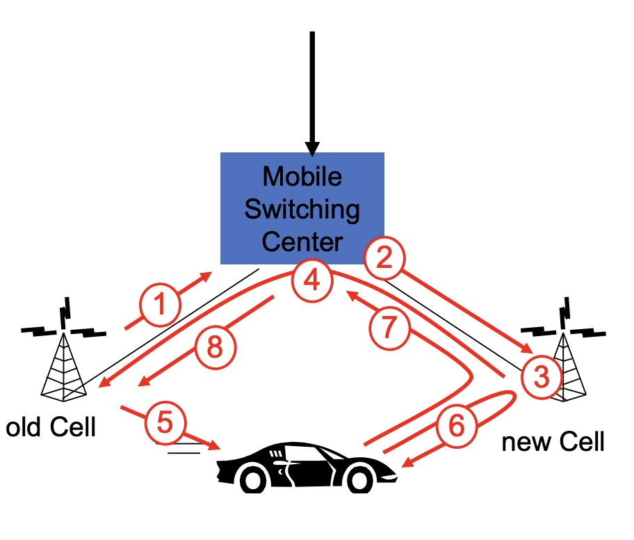

# Mobility

How do we handle IP address for mobile devices?

**Analogy:** you have a friend who moves a lot. Therfore, his address changes frequently (people take their mobile device to everywhere).

How can we send a package to your friend despite the fact that his last known address might not be up to date?

---

## IP Tunnel

The mobile device will tell the **home agent** its temporary IP address (for example, you're currently at a coffee shop and using its WIFI).

The sender will send the information to **home agent**, and the **home agent**, knowing the device's latest location, will deliver the information. 

---

## Smartphone Push Notifications

The same idea is also used for smartphone push notifications.

Whenever the phone gets a new IP address, it tells the central push notification server. 

When applications, like youtube or instagram, needs to send a notification to the device, they send it to the notification server, and server will deliver this notification to the specific user.

---

## Link-Layer Handoff

Handoff is the act of transferring an ongoing connection from one channel to another. 

Example: when you're driving, your phone moves from being connected to one cell tower to another. 

**GSM Cellular Connections**

This graph shows the architecture of cellular networks. Mobile devices use this network to talk to each other.

Handoff Steps:

1. Old cell informs MSC about the upcoming handoff.
2. MSC allocates resources to new cell.
3. New cell allocates channel for mobile device.
4. New cell tells old cell: ready.
5. Old cell tells device to handoff to new cell.
6. Mobile and new cell activate the new channel.
7. Mobile tells MSC: handoff complete.
8. Old cell resources are released.

