# Network Layer

---

## IPv4 Addressing

**IPv4 (Internet Protocol version 4)** is a Internet Protocol used to identify devices on a network.

### IP Subnet

Subnets are chunks of IP addresses in that can communicate directly, without traveling through a router.

In the graph below, a blue area is a subnet.

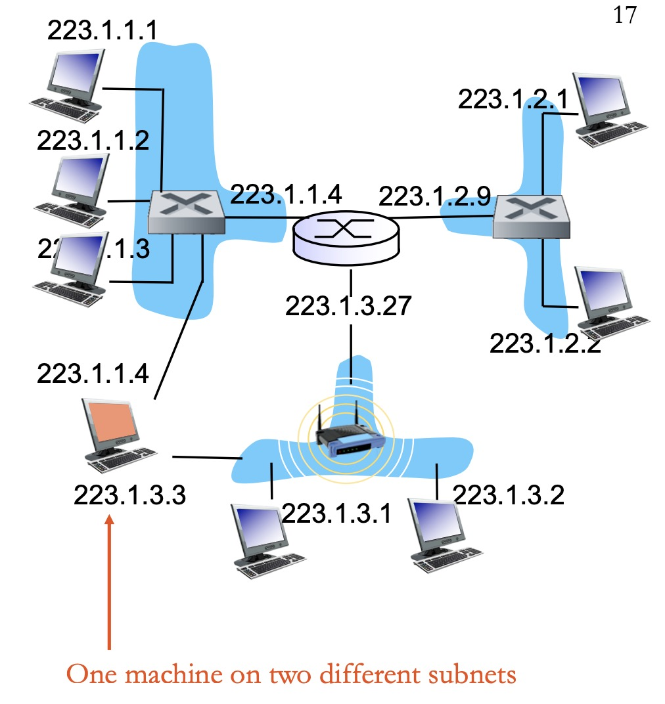

**Interface**: An interface is the connection between a device (like your computer or a router) and a physical network link.

Routers usually have multiple interfaces (for multiple links). Hosts usually have one or two interfaces (WiFi + wired).

**Subnet Mask**: A subnet mask is used to tell which part of the IP address identifies the subnet and which part identifies the host.

There are two common ways to express this:

- **CIDR Notation (Slash Notation):** For example, in **223.1.1.3/24**, the "**/24**" indicates that the first **24 bits** of the address identify the subnet, and the remaining **8 bits** identify the individual host.

- **Bitmask Notation:** The same "/24" range can be written as **255.255.255.0**. (The first 24 bits are 1, and the last 8 bits are 0).

### Forwarding Rules

When a packet arrives at the router, the router will use the forwarding rules to decide which output link the packet should be sent out on.

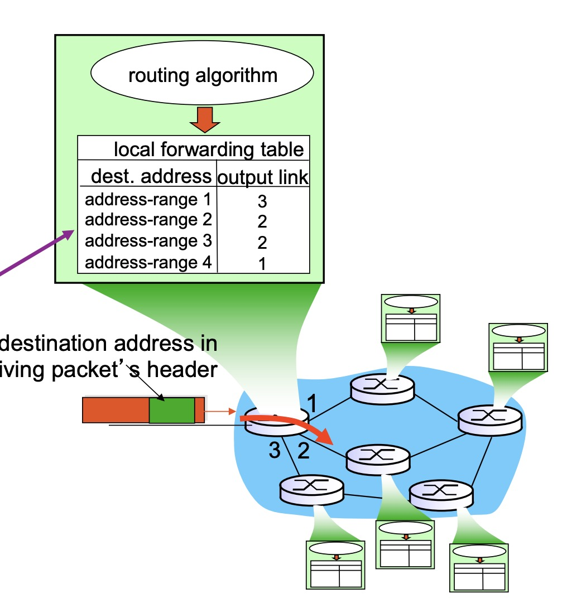

Forwarding tables in IP use longest prefix matching. Specifically, they check whether the IP address matches the pattern in the column "Destination Address Range" (see example below).

If more than one rule matches, choose the rule with longest prefix.

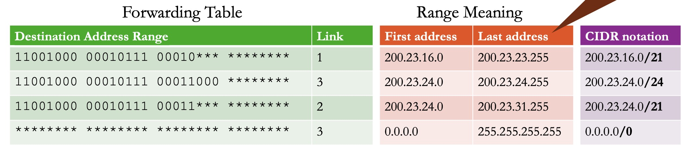

### IPv4 Packet (datagram)

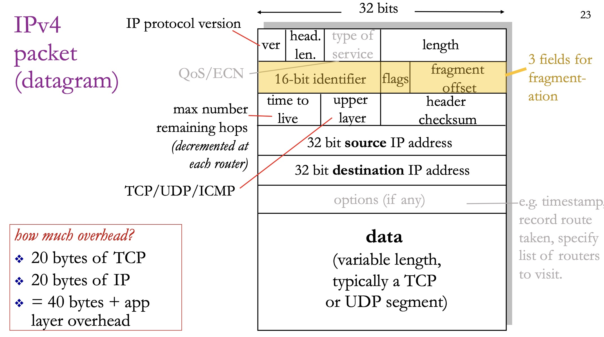

**IPv4 fragmentation**: Large IP datagrams may be fragmented anywhere, and reassembled at final destination.

---

## Network Address Translation (NAT)

Network Address Translation (NAT) rewrites **a private IP address** to **a public IP address**.

The **NAT router** makes your entire local network look like **one big machine** to the outside world. Every device on your local network gets a private IP address (like 10.0.0.12, 10.0.0.3, etc.), but when packets leave your network, the router rewrites them to use its single public IP address with different port numbers. Then NAT will store the address mapping.

*Example:*

Say your laptop is 10.0.0.1 on the local network, and your router's public address is 138.76.29.7.

Your laptop sends a packet to a web server. The NAT router intercepts this. It picks an unused public port — say 5001 — and **rewrites the source of the packet** to 138.76.29.7 port 5001.

10.0.0.1 ---> 138.76.29.7/5001

### Pros

**Security** — your local devices are invisible to the outside world.

**Configuration isolation** — if your ISP changes your public IP, nothing on your local network needs to change.

### Cons

The NAT only creates a port mapping when a local device sends a packet *out*. If someone on the Internet tries to reach your machine cold, the NAT has no mapping for them and just drops the packet. You need **port forwarding** — manually telling your router "anything that comes in on port 8080, send to 10.0.0.5."

---

## IPV6

The REAL fix for address exhaustion is **IPv6**. Instead of 32-bit addresses, IPv6 uses **128 bits**. It is written in hex, eight groups of four hex digits. Example: `a39b:239e:ffff:29a2:0021:20f1:aaa2:2112`

There are shorthand rules: you can replace consecutive groups of all zeros with `::` (but only once), and you can drop leading zeros in each group. So `0000:0000:0000:0000:0000:0000:0000:0001` becomes just `::1` — that's localhost.

### IPv6 Header Improvements

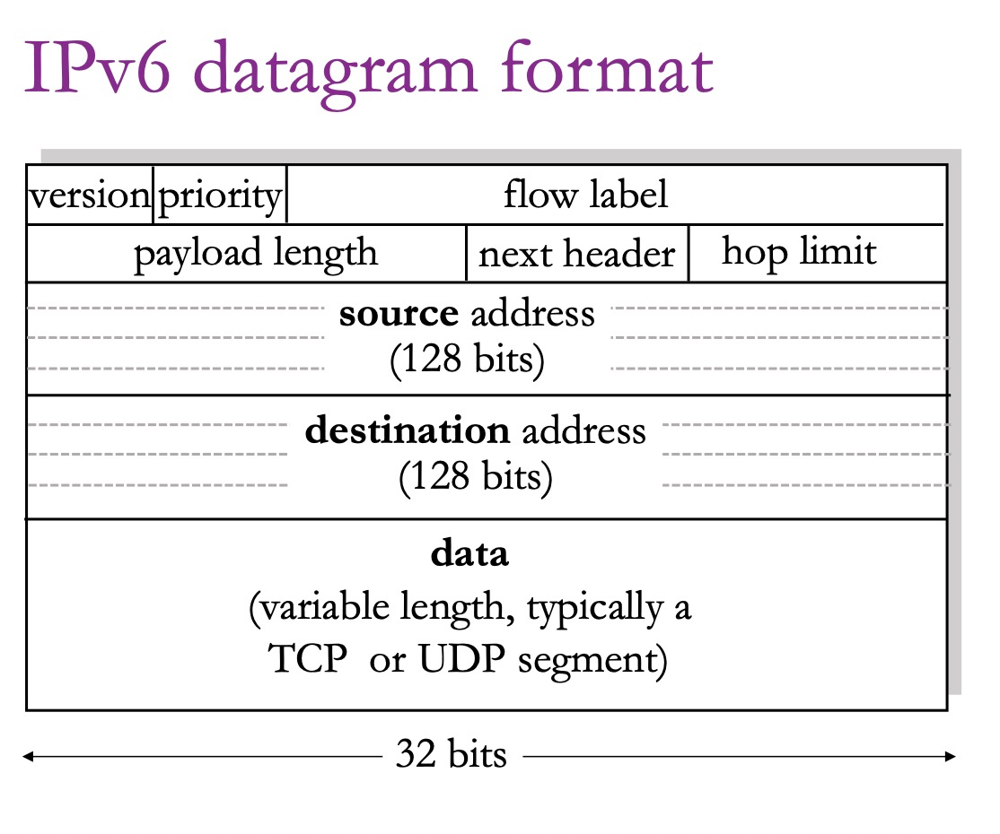

**No Checksum.** Because TCP/UDP already have checksums above, and Ethernet has one below. And since TTL (now called "hop limit") gets decremented at every router, the checksum had to be recalculated at every hop. 

The TTL (Time to Live) field is *part of the IPv4 header*. Every single router that forwards the packet decrements TTL by 1. But the moment you change even one bit of the header, the old checksum is no longer valid. So every router has to: decrement TTL, then **recompute the checksum over the entire header.**

**No Fragmentation.** IPv4 routers could fragment oversized packets. IPv6 says: routers should be simple and fast, let endpoints deal with fragmentation (TCP).

---

## Making IPv4 and IPv6 Coexist

### Tunneling

If you have two IPv6 "islands" separated by IPv4-only routers, you wrap the IPv6 packet inside an IPv4 packet, send it across the IPv4 network, and unwrap it on the other side.

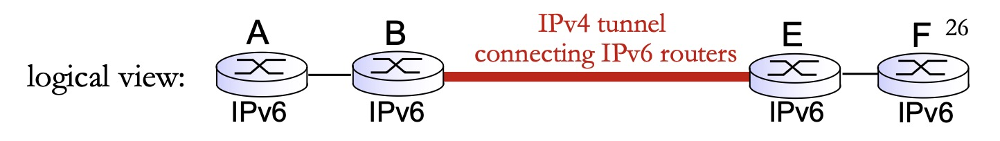

### Dual-stack

**Dual-stack** hosts have both an IPv4 and IPv6 address.

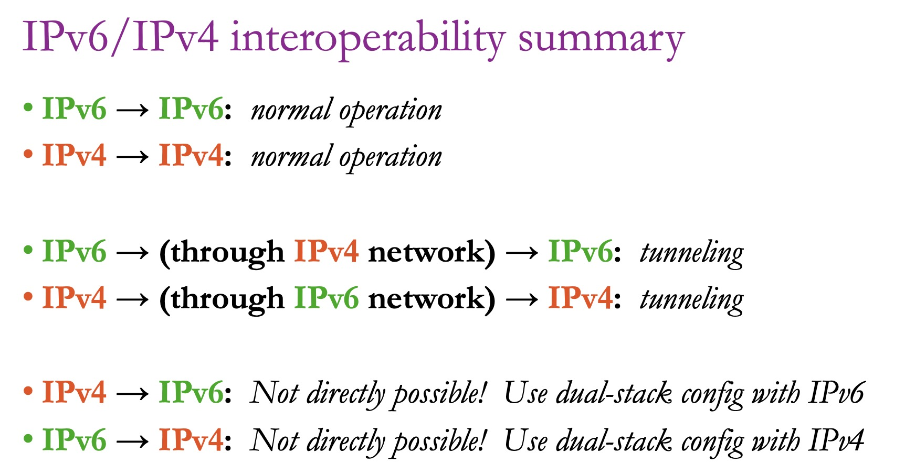

---

## Router

Think of a router as: **input ports → input queue → output queue → output ports.** Packets arrive on input ports, wait their turn, and leave on output ports. 

### The Switching Fabric

The internal interconnect between input and output ports.

**Bus-based:** Simple. Only one packet can cross at a time.

**Crossbar:** Multiple flows can cross simultaneously.

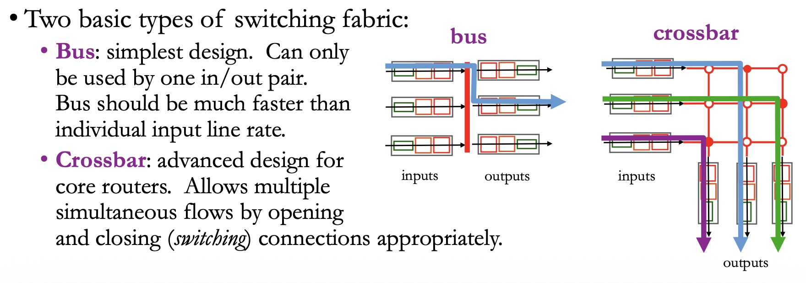

### Weighted Fair Queuing (WFQ)

Instead of a single FIFO queue, we have *multiple* queues with different priorities. An administrator classifies packets by header fields — source/destination IP, port number, protocol — and assigns each class a weight.

Spend w*i* time sending packets from queue *i*, then move to next queue.

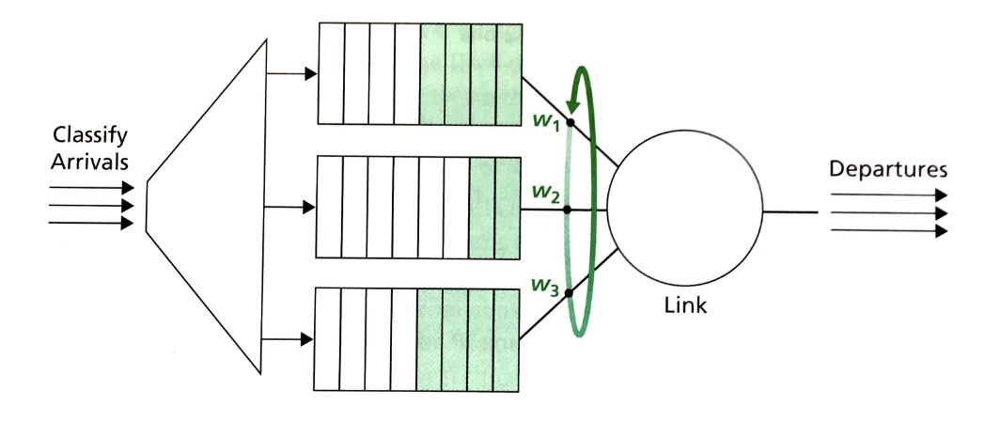

---

## Routing Algorithms

**Centralized (Link-State) algorithms:** Every router knows the entire network topology. Each router broadcasts its local link information to everyone, then independently computes shortest paths. Example: **OSPF**.

**Distributed algorithms:** Each router only knows its neighbors and gradually learns about the rest through iterative information sharing. Example: **BGP**.

### Bellman-Ford Algorithm

**Steps:**

Say you have a graph with **V** nodes and **E** edges. Pick a source node *s*.

Initialize two things for every node:

- `dist[s] = 0` (distance to yourself is zero)
- `dist[v] = ∞` for all other nodes (everything else is unknown)

**Repeat V−1 times:**

> For every edge (u, v) with weight w: If `dist[u] + w < dist[v]`, then update `dist[v] = dist[u] + w`

That's it. After V−1 rounds, you have the shortest distances.

### Dijkstra's Algorithm

**Step:**

Given a graph with **V** nodes and **E** edges, pick a source node *s*.

Initialize:

- `dist[s] = 0`
- `dist[v] = ∞` for all other nodes
- A set of **visited** (finalized) nodes, initially empty
- A **priority queue** (min-heap) containing (0, s)

**While the priority queue is not empty:**

> 1. Extract the node **u** with the smallest distance
> 2. If **u** is already visited, skip it
> 3. Mark **u** as visited
> 4. For every neighbor **v** of **u** with edge weight **w**:
>    - If `dist[u] + w < dist[v]`, update `dist[v] = dist[u] + w` and add (dist[v], v) to the priority queue

Once a node is marked visited, its distance is **final** — you never revisit it.

### Bellman-Ford vs. Dijkstra — When to Use Which?

|                 | Bellman-Ford                           | Dijkstra                       |
| --------------- | -------------------------------------- | ------------------------------ |
| Speed           | Slower: Θ(\|V\|·\|E\|)                 | Faster: Θ(\|E\|+\|V\|log\|V\|) |
| Negative edges? | Handles them (detects negative cycles) | Cannot                         |
| Implementation  | Naturally distributed                  | Best centralized               |
| Used by         | **BGP** (Distance Vector)              | **OSPF** (Link State)          |

---

## Hierarchical Routing

Why we need it?

**Scaling:**

• Too many routers (>100M) to solve one big shortest path problem.

**Administrative autonomy:**

• Internet is a *network of networks*

• Each network operator prefers to control its own *internal* routing policy.

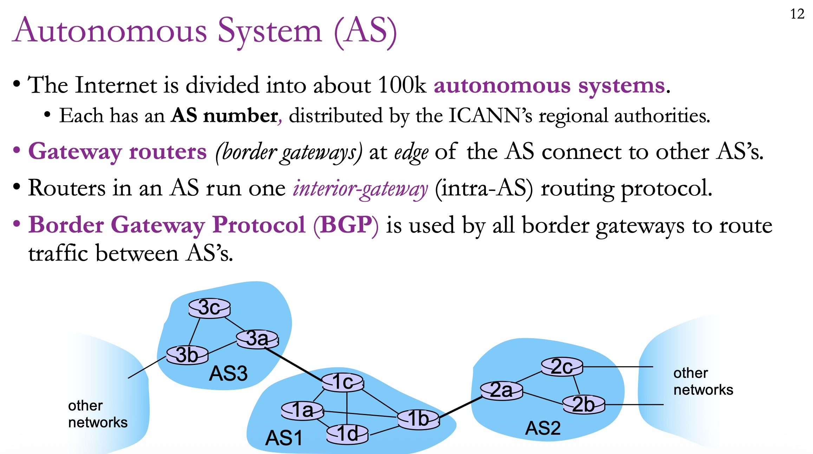

**Inside an AS** — you use an Interior Gateway Protocol (IGP). This could be whatever the network admin prefers.

**Between ASes** — everyone uses BGP.

---

## Border Gateway Protocol Routing

Mechanism:

1. I receive an **advertisement from a neighbor** or **detect a local link change.**

2. I recalculate my best routes.

3. **If my DV changes, I advertise my DV to my neighbors.**

4. This ripples outward until nobody's routes change — convergence.


A BGP advertisement — the "distance vector" in this context — is a list of **routes**. Each route looks like this:

```
{PREFIX: 43.5.0.0/16, AS_PATH: [AS4, AS65, AS1], NEXT_HOP: 5.6.7.200}
```

It says: "If you want to reach the subnet 43.5.0.0/16, send packets to my router at 5.6.7.200, and they'll travel through three autonomous systems to get there."

The AS_PATH serves double duty: its **length** tells you the hop count (like a cost), and the **contents** let you detect loops.

When a router has multiple routes to the same prefix, how does it choose? There's a priority order:

**First: Local preference.** This is a hard-coded policy — the network admin says "I prefer routes through AS2 over AS1" for business reasons, regardless of path length. Money talks.

**Second: Shortest AS_PATH.** Fewer AS hops is better.

**Third: Hot potato routing.** If two routes have equal AS_PATH length, **pick the one whose NEXT_HOP is closest to your own AS** (using your IGP metrics). The idea is: get the packet out of my network as fast as possible. Like a hot potato — I don't want to carry it any longer than I have to.

**Fourth: Tie-breaker.** If everything else is equal, use some arbitrary rule like BGP router ID.

*Example:*


---

## Link State Routing

**Link-State Advertisement (LSA)** contains:

- Its own router ID
- A list of its neighbors
- The cost to reach each neighbor
- A sequence number (router increment sequence number everytime it sends a new one)

A router generates an LSA in the following situations:

- A neighbor goes down
- A new neighbor comes up
- The cost of a link changes

### How It Works

Each router stores:

**Link-State Database (LSDB)**

Note: LSDB stores LSAs, instead of edge information.

**Latest received sequence number from router**

**Routing Table (Destination, Cost, Next Hop)**

For every node, whenever there is a change in its direct links:

**Step 1 — Build a Link-State Advertisement (LSA), and broadcast it to all other routers using flooding.**

When an LSA arrives, the receiving router checks:

- If the sequence number is **lower than or equal to** what's already stored → The router **drops it silently** and does not flood it further. This breaks the cycle.
- If the sequence number is **higher** than what's stored → the LSA is new and contains updated information. The router **Stores LSA in its LSDB** and **floods it onward**.

**Step 2 — Run Dijkstra's Algorithm (SPF)** Using the LSDB as the graph, each router independently runs **Dijkstra's Shortest Path First (SPF)** algorithm to compute the shortest path tree rooted at itself and use it to build its **Routing Table**.

---

## Broadcast

### Broadcast strategy #1: Controlled Flooding

Node retransmit message only the first time it sees the message.

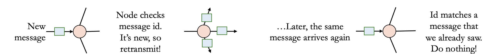

### Broadcast strategy #2: Spanning Tree

We only transmit message along the spanning tree.

We could choose either **Minimum Spanning Tree** or **Shortest Path Spanning Tree**.

**Minimum Spanning Tree:** minimizes the total cost of edges in the spanning tree.

**Shortest Path Spanning Tree:** minimizes cost of the the longest path in the spanning tree.

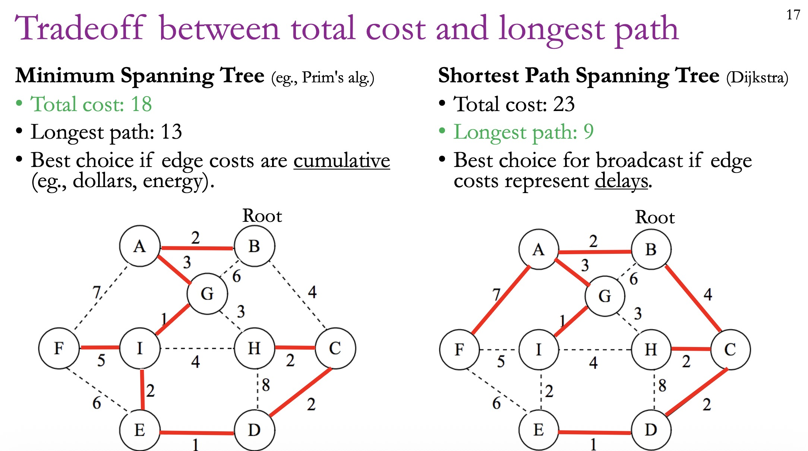
