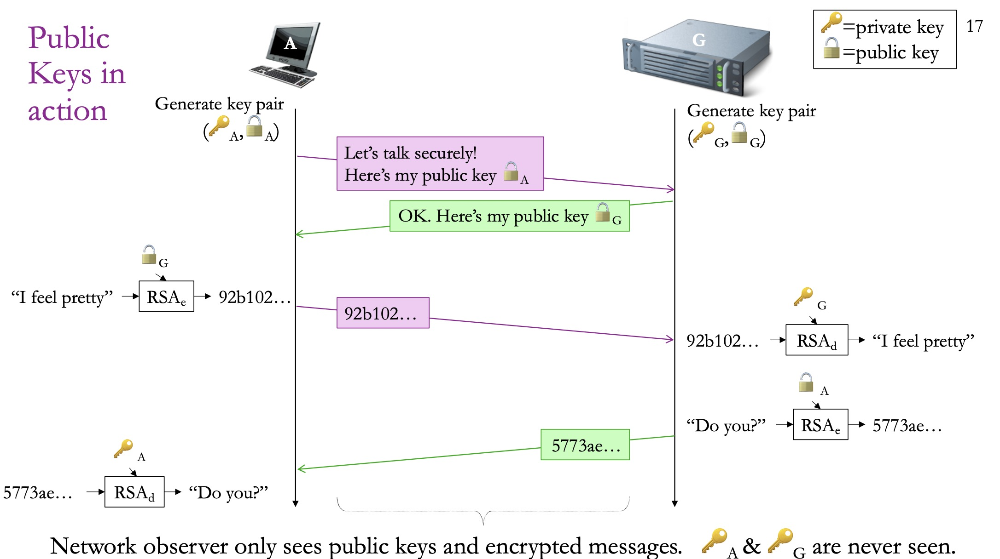
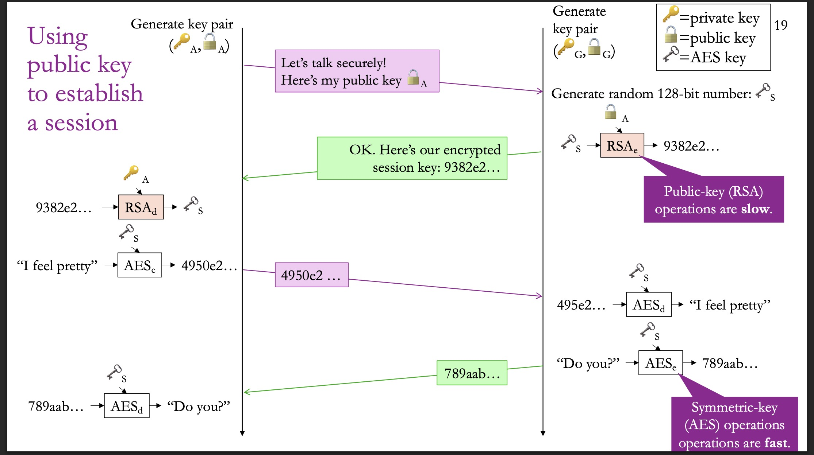
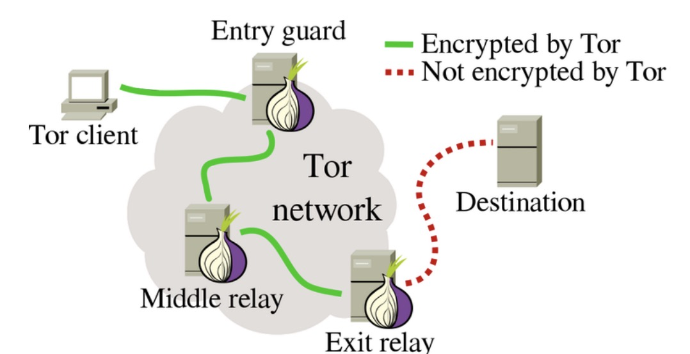
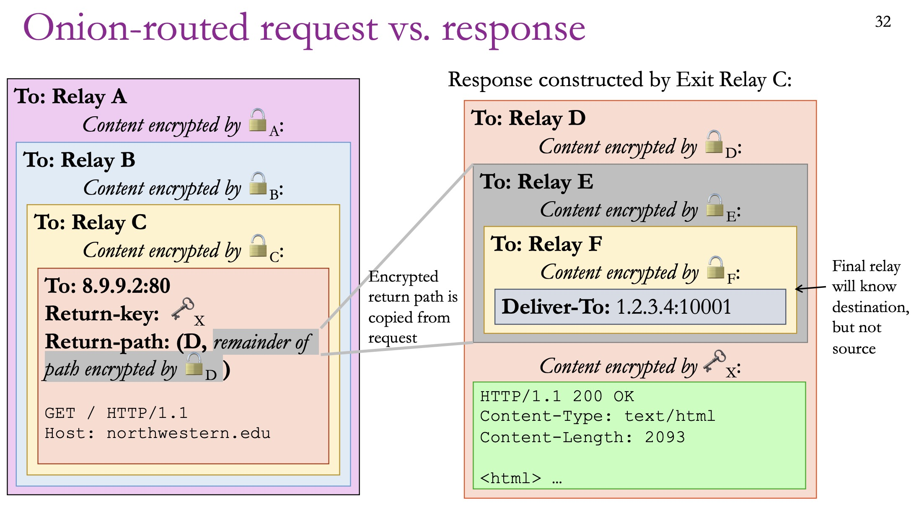
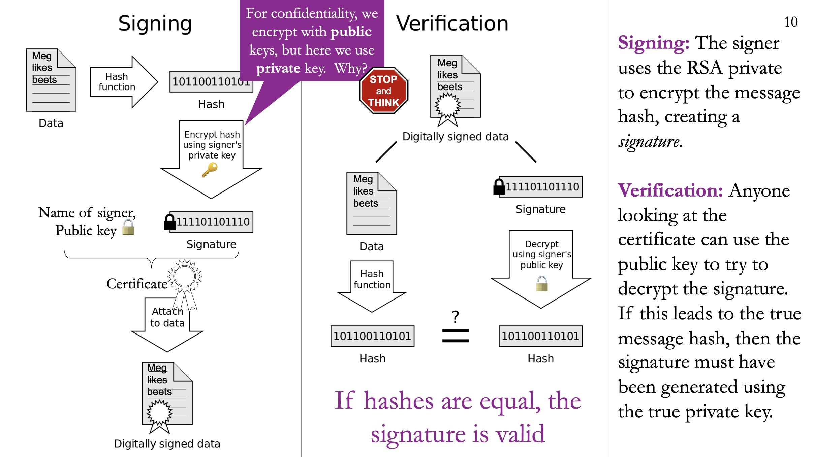
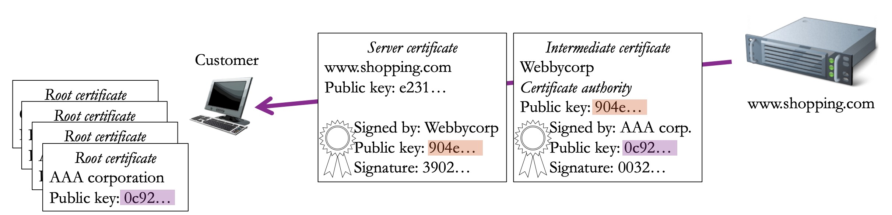

# Security

---

## Advanced Encryption Standard

AES is a **symmetric-key** encryption algorithm: the same key is used to encrypt and decrypt.

---

## Public Key Cryptography

Public Key cipher is **asymmetric** because it uses two related keys: 

- **Public key** is used for **encryption**. 

- **Private key** is used for **decryption**.

These two keys are mathematically related, so they must be generated together.

Assume A wants to talk to B, here are the steps:

1.  A requests B's public key. (This is basically saying "hey I want to talk to you secretly").
2. B sends its public key to A.
3. A sends a message encrypted using B's public key.
4. B decrypts the message using its private key.



Public key algorithms like RSA are much more computationally expensive than symmetric ciphers like AES. 

In practice, we use public key cryptography just to exchange a shared key (a session key), then use AES for the remaining messages.

Steps:

1.  A sends its public key to B.
2. B sends an AES key to A. This message is encrypted using A's public key.
3. A decrypts the message and gets AES key.
4. A and B then communicate using the AES key.



---

## Onion Routing

Even with encrpytion, the network knows who you are. So we need anoymity.

Onion Routing creates an overlay network at the application layer. The key idea is: the message will go through multiple servers to hide the true sender.

The relays has public key and private key, so any client could talk to them to send a message.



### Send Anoymous Request

Assume sender wants to send a message to destination, using relay A, B and C (in order).

Steps:

1. In the message, we will include a return-path and a return key (symmetric key used to encrypt response message). Then we will wrap the message using the public key in the reversed order (in our example, it would be C, B and A) of the relays we will go through.

2. When relay A gets the message, it decrpyts it and send to relay B.

3. When relay B gets the message, it decrpyts it and send to relay C.

4. When relay C gets the message, it decrpyts it and send to the destination.

   Note that relay C knows the content of the message, but doesn't know the sender. This is the key of onion-routing.

### Send Anoymous Response

Steps:

1. When destination gets the request, it creates the response, and encrypted it using the provided return key.

2. Destination host looks at the return path and knows it needs to send to D. 

   Note: it could only see the first relay in the path.

3. When relay D gets the message, it decrpyts the encrypted path and send it to E.

4. When relay E gets the message, it decrpyts the encrypted path and send it to F.

5. When relay F gets the message, it decrpyts the encrypted path and send it to the original sender.

   Note: final relay will know who the message is returned to, but doesn't know the source of the message.

6. Original sender decrypts the response body using the return key.



---

## Authentication

The key question: you got the public key from the website. How do you know you're talking to the website you're talking to? How do you know that it isn't some hacker that provided you with a fake public key, and wishes you to share information to them?

### Digital Signature

A digital signature is a short bit-sequence generated from a digital document and a private key, with the following properties:

- The document cannot be signed without a private key.

- The signature can be verified using only the corresponding public key.

 Changing a signed document will make the former signature invalid.

*Example:*

Assuming Meg wants to send the message "Meg likes beets" and let receivers know she is the one who sends it. 

*Signing steps:*

1. Use a hash function to generate a hash of the message.

   Note: the hash function is publicly available.

2. Use the private key to encrypt the hash. This generates the signature.

3. Attach the signature to the original message. This is the digitally signed data.

*Verification steps:*

1. On the left side, we gets the message, use the hash function to generate a hash.
2. On the right side, we take the signature, decrypt it using signer's public key. The result is a hash.
3. We compare the two hash. If they are equal, then the signature must be true.



### Chain of Trust

```
Root Authority → Certificate Authority → Website
(you trust)      (CA vouches for)        (CA vouches for)
```

**Step by step:**

1. **Root Authorities** are a small number of highly vetted organizations (like DigiCert, Let's Encrypt, or government bodies). Your operating system come pre-loaded with their public keys.

2. **Certificate Authorities (CAs)** are organizations that root authorities have vouched for.

3. **Website owners** go to a CA and say *"I own google.com — here's my public key, please sign it."* The CA verifies this is true (checking domain ownership, sometimes company identity), then creates the intermediate certificate.

4. **When you visit a website**, it hands you its server certificat and intermediate certificate from CA. 

   a. The intermediate certificate verrifies the public key belongs to the host we want to talk to (public key is true).

   b. The server certificate verifies that the host we're talking to is the host we want to talk to (host is true).


