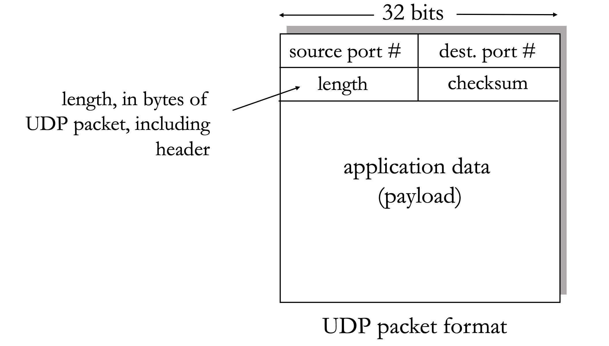
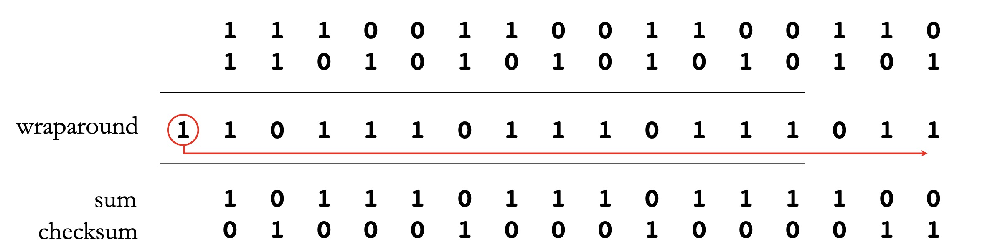
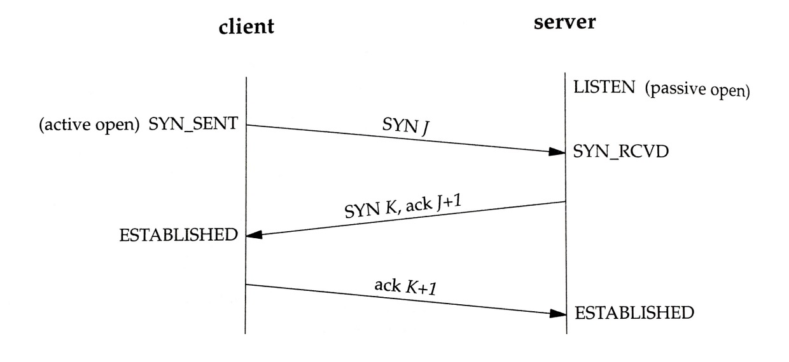
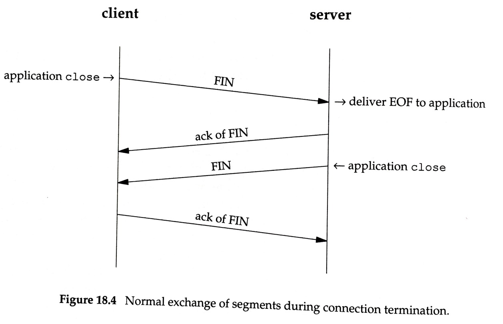
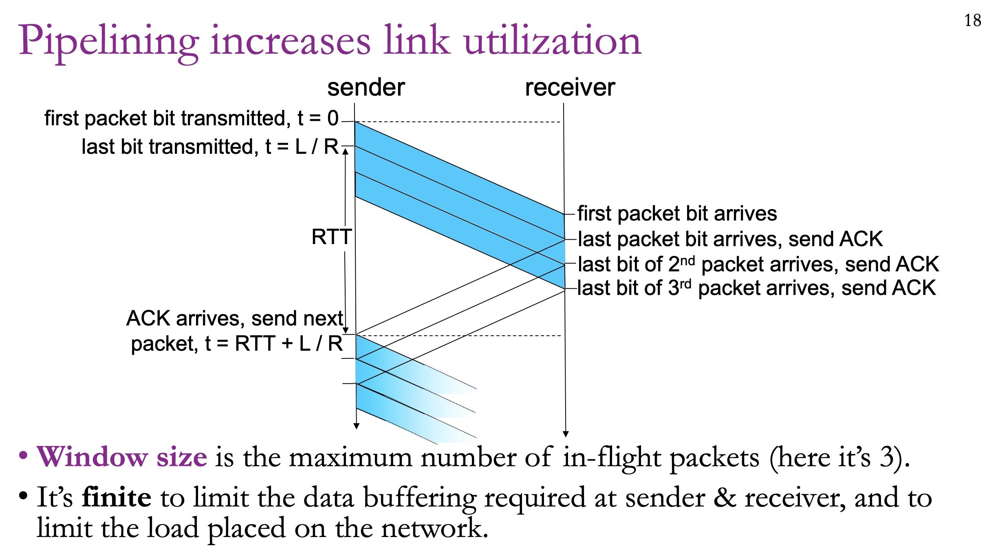
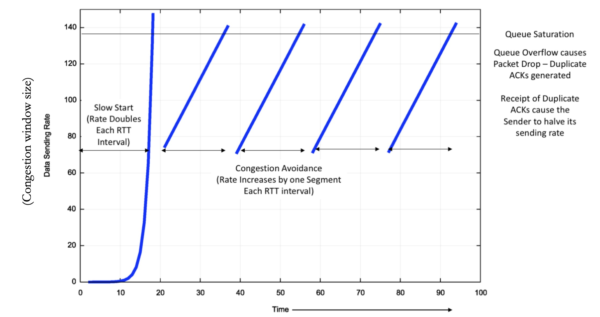
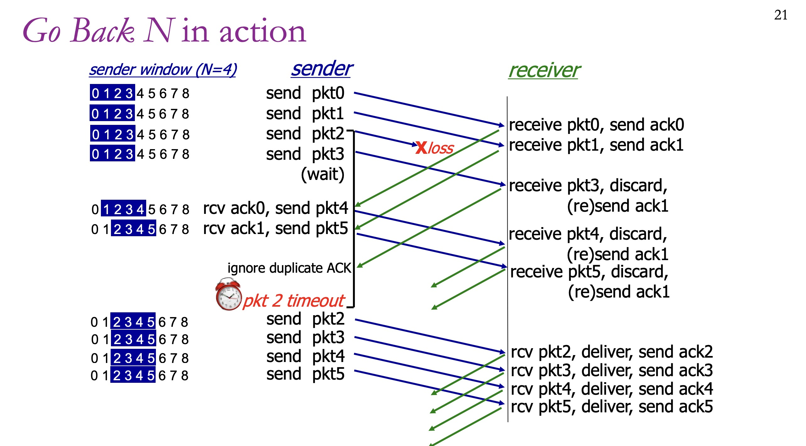

# Transport Layer

---

## UDP

The **User Datagram Protocol (UDP)** is the simplest transport protocol. It is essentially IP with two small additions:

1. **Port Numbers:** To tell the computer which application the packet belongs to.
2. **Checksums:** A mathematical summary of the data used to detect corruption.

> **Crucial Note:** UDP is **unreliable**. If a packet is lost, UDP doesn't care. If a bit is flipped, the checksum detects it, and the receiver simply **drops** the packet. It does not try to fix it.

---

## Checksum

1. Break the data into a sequence of 16-bit integers
2. Add the integers
3. Wrap the carry-out bits to the least-significant position
4. Invert the result.
5. Include the Checksum into the package.

---

## TCP

To make a connection "reliable" (like TCP), we have to solve the problems of the underlying Internet: **packet loss, corruption, and reordering.**

### 1. Sequence Numbers

Unlike some protocols that count packets, TCP counts **bytes**.

- **Definition:** The Sequence Number in a TCP segment tells the receiver where that segment fits into the overall "stream."
- **The Offset:** It indicates the index (offset) of the **very first byte** of data included in that specific packet.
- **Example:** If you have already sent 1,000 bytes and you are sending a new packet with 500 more bytes, the sequence number for this new packet would be 1,001.

### 2. Cumulative ACKs

TCP uses "Cumulative Acknowledgments," which means an ACK doesn't just confirm one packet—it confirms everything received up to a certain point.

- **The "Next Expected" Rule:** When a receiver sends an ACK, the "Acknowledgment Number" it provides is the sequence number of the **next byte** it is waiting for.
- **Example:** If a receiver sends `ACK 101`, it is telling the sender: *"I have successfully received everything up to byte 100. Please send byte 101 next."*

### TCP Connection Setup

Three-way handshake sets up the connection.

1. SYN: Initiator sends its parameters (initial sequence number, window size, etc.). 

   Note: a random sequence number is chosen. 

2. SYN-ACK: Listener sends ACK including its own parameters.

3. ACK: Initiator ACKs (and may include first segment of data). 

|         | Sequence Number | Acknowledgement Number |
| ------- | --------------- | ---------------------- |
| SYN     | J               |                        |
| SYN-ACK | K               | J + 1                  |
| ACK     |                 | K + 1                  |

### TCP Connection Close

Each side of the connection sends FIN to say it’s finished sending.

### How TCP Sends Packages

#### Stop-and-Wait

The simplest computer solution is **Stop-and-Wait**:

1. Sender sends a packet.
2. Sender waits for an ACK.
3. If a timer expires (timeout) before the ACK arrives, the sender retransmits.

**The Problem?** It’s incredibly slow. If you’re sending data from New Jersey to California, the "dead time" spent waiting for ACKs means you’d only use a tiny fraction of your link's actual speed.

#### Pipelining

Instead of sending one packet and waiting, we send a "window" of multiple packets at once.

### TCP Congestion Control

#### TCP Reno

1. Slow Start: "The Probing Phase"

When a connection starts, TCP doesn't know how much traffic the network can handle.

- **Initial State:** It starts very small (typically 1 Maximum Segment Size or MSS).
- **The Growth:** For every ACK received, the window doubles. Even though it's called "Slow Start," the growth is actually **exponential** ($1 \to 2 \to 4 \to 8 \dots$).
- **The Goal:** Quickly find the "ceiling" of the network capacity.
- **Exit Strategy:** It stops doubling when it hits a limit called `ssthresh` (slow-start threshold) or when a packet is lost.

2. Congestion Avoidance: "The Cautious Phase"

Once the sender reaches the `ssthresh`, it assumes it is close to the network's limit and becomes more conservative.

- **The Growth:** Instead of doubling, it increases the window by only 1 MSS per Round Trip Time (RTT). This is **linear growth**.
- **The Goal:** Carefully "poke" the network to see if more bandwidth has become available without causing a massive crash.

3. Fast Recovery: "The Quick Fix"

This phase is triggered when the sender receives **three duplicate ACKs**. This is a specific signal: it means the network is congested (one packet was lost), but it’s not "dead" (later packets are still getting through to trigger those ACKs).

- **The Action:** Instead of dropping all the way back to the beginning (Slow Start), TCP Reno cuts the window in **half** (`cwnd = cwnd / 2`).
- **The Goal:** Maintain high throughput by not restarting from scratch when the congestion is only moderate.

#### Vegas Congestion Control

TCP Vegas is a congestion control algorithm that uses packet **Round-trip Time (RTT)** to infer network congestion rather than relying on packet loss.

- **Congestion Signal**: It monitors changes in RTT. If the sender is operating below maximum throughput, RTT remains fixed. When the sending rate exceeds capacity, router queues begin to fill, causing RTT to rise, which Vegas interprets as a signal of congestion.
- **Reaction to Congestion**: Gently increases or decreases the window by a constant amount to stay within a target throughput range.
- **Performance Benefits**: It can achieve throughput near the network's maximum while keeping router buffers nearly empty, which optimizes RTT.
- **Major Drawback**: Vegas flows do not receive a fair share of bandwidth when they compete on the same network with more aggressive "loss-based" algorithms like TCP Reno or CUBIC.

### Nagle’s Algorithm

Nagle’s algorithm is a simple rule that forces the sender to buffer data create larger packets.

The logic follows these steps:

1. **If there is a full MSS** (Maximum Segment Size) worth of data to send, send it immediately.
2. **If there is no unacknowledged data** (all previous packets have been ACked), send the data immediately (even if it's small).
3. **Otherwise:** Buffer the data until a full MSS is reached or until the outstanding ACK arrives.

---

## Sliding Window Strategies

### Strategy 1: Go Back N

Window size is N, sender can have up to N packets in flight.

Receiver sends cumulative ACK: “I got everything up to seq. number x”

If sender does not get an ACK after some timeout interval, resend all packets starting from packet after the last ACK’ed packet.

### Strategy 2: Selective Repeat

In Selective Repeat, both the sender and receiver maintain a window of size $N$.

1. **The Sender's Logic**

- **The Window:** The sender can transmit up to $N$ packets without waiting for an ACK.
- **Individual ACKs:** Unlike Go-Back-N, the sender tracks ACKs for **each packet individually**.
- **The Slide:** The sender's window "base" only moves forward when the **oldest unacknowledged packet** is finally ACKed. If the sender receives ACKs for packets further ahead in the window, those packets are marked as "received," but the window stays put until the "hole" at the base is filled.

2. **The Receiver's Logic**

- **The Window:** The receiver also has a window of size $N$, allowing it to accept packets that arrive out of order.
- **Buffering:** If the receiver gets a packet that is within its window but is *not* the next one in sequence (the base), it **buffers** it.
- **The Slide:** The receiver's window "base" only moves forward when the **oldest missing packet** arrives. At that moment, the window slides forward as far as possible, delivering all contiguous, buffered packets to the application layer.
